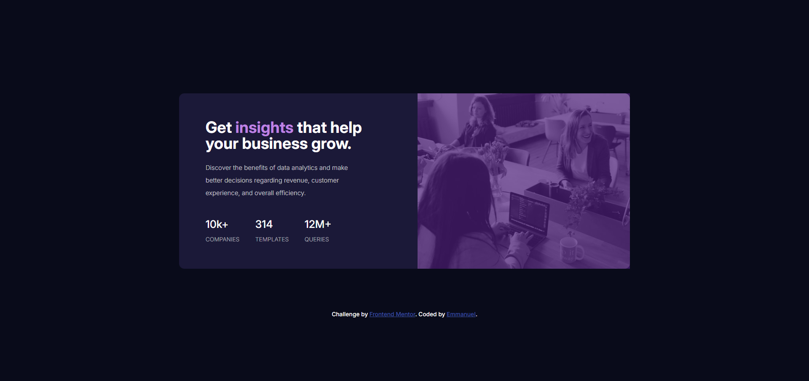

# Frontend Mentor - Stats preview card component solution

This is a solution to the [Stats preview card component challenge on Frontend Mentor](https://www.frontendmentor.io/challenges/stats-preview-card-component-8JqbgoU62). Frontend Mentor challenges help you improve your coding skills by building realistic projects.

## Table of contents

- [Overview](#overview)
  - [The challenge](#the-challenge)
  - [Screenshot](#screenshot)
  - [Links](#links)
  - [Built with](#built-with)
  - [What I learned](#what-i-learned)
- [Author](#author)
- [Acknowledgments](#acknowledgments)

**Note: Delete this note and update the table of contents based on what sections you keep.**

## Overview

### The challenge

Users should be able to:

- View the optimal layout depending on their device's screen size

### Screenshot



### Links

- Solution URL: [https://github.com/Notobd/stats-prevew-card.git](https://your-solution-url.com)
- Live Site URL: [https://vercel.com/emmanuels-projects-426f3dc0/stats-prevew-card](https://your-live-site-url.com)

### Built with

- Semantic HTML5 markup
- CSS custom properties
- Flexbox

### What I learned

Learnt how to use overlay on this projec and it seems I am getting better with making a page responsive.

```css
.deskmob-image {
  position: relative;
}
.deskmob-image::after {
  content: "";
  position: absolute;
  top: 0;
  left: 0;
  width: 100%;
  height: 100%;
  background-color: hsla(270, 60%, 30%, 0.7);
  z-index: 1;
```

## Author

- Frontend Mentor - [@notobd](https://www.frontendmentor.io/profile/notobd)
- Twitter - [@no0tobd](https://www.twitter.com/n0tobd)

## Acknowledgments

Favour all thanks for your input.
